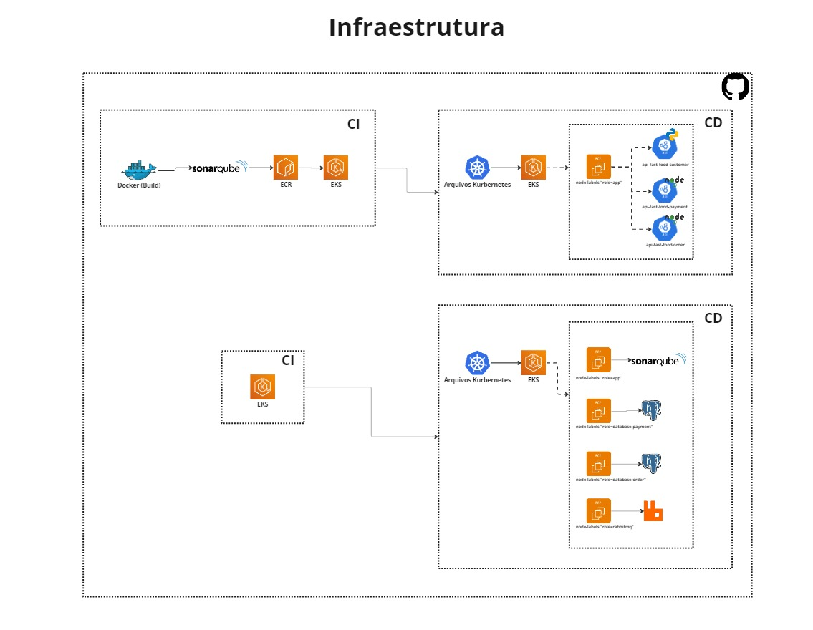

# infra-tech-challenge
Este repositorio tem como objetivo cuidar da infraestrutura de nossas aplicações, e cuidar do processod e CI/CD disponivel no GitHub Actions.

Dentro do projeto é possivel realizar o deploy de 6 aplicações diferentes, sendo elas:
1. Deploy da infraestrutura do EKS;
2. Deploy do DynamoDB;
3. Deploy do postgres para o serviço de pedidos;
4. Deploy do postgres para o serviço de pagamento;
5. Deploy para o rabbitMq;
6. Deploy para o sonarQube;

Todos estes deploys são realizados utilizando kubernetes.

 ## Segregação de EC2
Para manter um ambiente mais seguro, foi criado uma instancia EC2 para cada banco de dados, uma para o rabbit e outra para as aplicações, ficando assim em 4 nodes.

## Validação de acesso nos Banco de Dados
